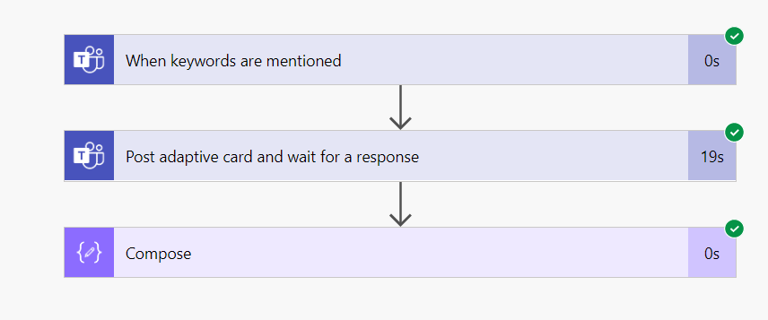

 # My Portfolio

## Introduction

> “My powers are ordinary. Only my application brings me success.” ~ Isaac Newton

Hi, I'm Mary, a developer. Welcome to my portfolio!

---

## Experience

  

    <h3>Custom Development</h3>
    <ul>
      <li>Maintaining system code</li>
      <li>Web development</li>
      <li>Documentation</li>
      <li>Building custom applications</li>
      <li>Languages: React.js, JavaScript, C#</li>
    </ul>
  

  

    <h3>Power Platform Developer</h3>
    <ul>
      <li>Building Business Apps</li>
      <li>Automating Processes with Power Automate</li>
      <li>Integrating external systems with Adaptive Cards (Binder/AIDL)</li>
      <li>Languages: Power FX, Javascript, C#</li>
    </ul>
  

  

    <h3>CRM Developer</h3>
    <ul>
      <li>Dynamics 365 Developer</li>
      <li>Maintaining Dynamics CRM</li>
      <li>Languages: JavaScript, C#</li>
    </ul>
  

  

    <h3>Tutorials & Development</h3>
    <ul>
      <li>YouTube Tutorials</li>
      <li>Freelance App Dev</li>
    </ul>
  

---

## Projects

  

    <h3>Power Automate Project</h3>
    
    <ul>
      <li>Built Helpdesk using Power Automate, Adaptive Cards, and Teams</li>
      <li>Multiple workflows for automation</li>
    </ul>
  

  

    <h3>Custom Projects</h3>
    [![Project3]](./project3Image.png)
    <ul>
      <li>Built a console App that runs on a daily basis and checks the all user access then stores file in blob storage, to be used for fire drill when necessary.</li>
      <li>The app interface was created in PowerApps, backend was coded as a console app using C# and run daily.</li>
      <li>Other projects include, my portfolio is developed using React.js</li>
    </ul>
  

  

    <h3>Project 3</h3>
    
    <ul>
      <li>My youtube channel Learn with Lala is just at the beginning of its youtube journey.</li>
      <li>Currently working on my Youtube channel providing tutorials on the Power Platform.</li>
      <li>Tutorials on Adaptive cards and other uses for it.</li>
      <li>Currently under construction, pending more video tutorials.</li>
    </ul>
  

---

## Contact Me
Please feel free to get in touch for a consultation. If you have questions regarding PowerApps/Power Automate, Adaptive cards, etc.
Please message @
[mary.narainsamy@gmail.com](mailto:mary.narainsamy@gmail.com) 
